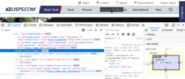
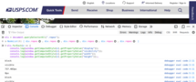
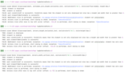
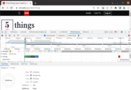

## Objective for selenium-junit-practice

to have a **foundational project**
  - utilizing Selenium with PageFactory for UI testing
  - RestAssured for API testing
  - configurable to run locally or in dockerized Jenkins with browsers in containers spun by Selenoid
  - with a static html file served by Jetty server to add some setup and networking challenge
  - that produces html-based reports using different approaches with screenshots on failure included
  - overcoming technical and domain specific challenges [providing correct configurations and expectations]

## Choice of example test classes

- **ElementsStatsTest**
   - Being initially confused and sidetracked by the facts that
     1. in devtools Console JavaScript window.getComputedStyle method (which returns values of all CSS properties of an element) considers "invisible to human eye" zero height element to be visible, the reason being that it is just a [property](https://www.w3schools.com/jsref/prop_style_visibility.asp) 
        
        
        
     2. [visibilityOfElementLocated](https://www.selenium.dev/selenium/docs/api/java/org/openqa/selenium/support/ui/ExpectedConditions.html#visibilityOfElementLocated(org.openqa.selenium.By)) method in Selenium's ExpectedConditions class states that "Visibility means that the element is not only displayed but also has a height and width that is greater than 0"
     3. W3C's WebDriver recommended approach to [element's displayedness](https://www.w3.org/TR/webdriver1/#element-displayedness) is that it does not relate to the visibility or display style properties and element should in general be considered visible if any part of it is drawn on the canvas within the boundaries of the viewport

     wanted to have an empirical way to go through a checklist for a custom element running Selenium methods such as: isDisplayed, visibilityOf, isEnabled, isClickable, click by WebElement's method, click by Actions' method.
      Custom elements are specified in an html page which is served by Jetty server. 

- **WebDriverW3CClientTest**
   - Used RestAssured library to do API requests specified by ['WebDriver W3C' protocol](https://www.w3.org/TR/webdriver1) to compare direct protocol use and results returned by Selenium library implementation of [WebElement interface](https://www.javadoc.io/doc/org.seleniumhq.selenium/selenium-api/4.6.0/org/openqa/selenium/WebElement.html). Interesting differences in case of decimal values for [location and size](https://www.w3.org/TR/webdriver1/#get-element-rect) measurements of elements. 
     Test class is parameterized using element locators. Class parameterization is JUnit4 feature, while JUnit 5 also allows method parameterization.

- **CnnFiveThingsSmokeTest**
   - Stumbled upon CNN's "5 Things Weekly News Quiz" and thought that having tests going to the CNN's site will promote news reading and being more informed. Was surprised to discover that CNN's 5-things page has long page load time (time to JS 'onload' event, for which Selenium waits up to PageLoadTimeout units), on average 40+ sec. Test checks link to quiz in Sunday post. TO DO: Prevent failures at night due to article upload happening between 4am and 5am Eastern time. 
     

## Operational use cases and their specificities

### [Option 1](option1.md)
**[Run](option1.md) test cases 
by maven 
in dockerized Jenkins' agent to which Jenkins clones project's local git repository 
with browsers provided by dockerized Selenoid 
when Jenkins, Jenkins's agent, Selenoid and browsers are all on the same docker bridge network**

### [Option 2](option2.md)
**[Run](option2.md) test cases 
by maven 
from IntelliJ 
with browsers provided by dockerized Selenoid**

### [Option 3](option3.md)
**[Run](option3.md) test cases 
by maven 
from dockerized project 
with browsers provided by dockerized Selenoid**

### [Option 4](option4.md)
**[Run](option4.md) test cases 
by maven 
from dockerized project 
with browsers spun inside the same container**

### [Option 5](option5.md)
**[Run](option5.md) single test case 
from IntelliJ**

### [Option 6](option6.md)
**[Run](option6.md) single test case 
by maven 
from command line**

### [Option 7](option7.md)
**[Run](option7.md) test suite 
without maven 
from jar package with tests 
on the command line 
with static html file served by manually started Jetty server**